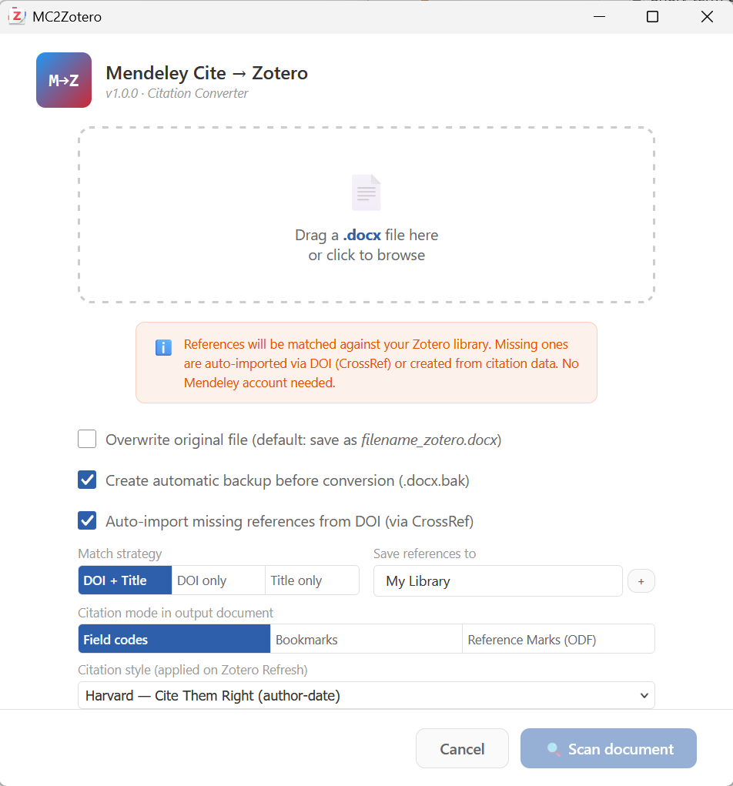

# Mendeley Cite to Zotero

Mendeley Cite to Zotero converts live Mendeley Cite citations in a Word `.docx` manuscript into editable Zotero citations.



## What it does

- Scans Mendeley Cite fields in a Word document.
- Matches references in your Zotero library by DOI and normalized title.
- Can import a missing item by DOI through Crossref.
- Produces a separate converted document and preserves the source file.
- Supports Word field codes, bookmarks, and ODF Reference Marks.
- Applies the selected citation style when Zotero first refreshes the document.

## Using the converter

1. Open the converter from Zotero's **Tools** menu.
2. Select the Mendeley Cite `.docx` file.
3. Choose the output mode and review reference matches.
4. Convert the document.
5. Open the new file and run Zotero **Refresh**.

## Installation

1. Download the latest `.xpi` from [Releases](https://github.com/sorinhostiuc/mc2zotero/releases/latest).
2. In Zotero, open **Tools > Plugins**.
3. Choose **Install Plugin From File**, select the `.xpi`, and restart Zotero if asked.

The plugin supports Zotero 7 through 9.

## Development

```bash
npm ci
npm run build
```

## License

[MIT](LICENSE)
